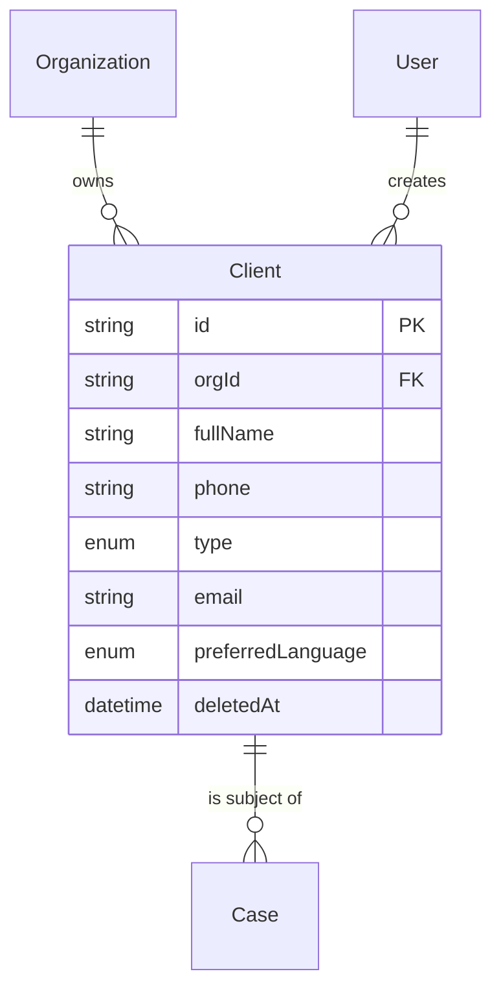

# Clients Module — Design

**Last updated:** 2026-05-19
**Branch:** chore/cases-backend
**Status:** Spec — implementation in progress

---

## Overview

The client record is the advocate's contact sheet for the person behind the case. When a client calls asking about their matter, the advocate must pull up full context within 5 seconds. The client record makes that possible.

In Phase 1, clients never log in or see anything. The record is purely for the advocate's reference — who the person is, how to reach them, what cases they have, which language to use when sending hearing reminders.

One client can have many cases. A client record is created once and reused across cases.

---

## Relations



---

## Data Model

### Prisma Schema

```prisma
model Client {
  id                String             @id @default(uuid())
  orgId             String             @map("org_id")
  fullName          String             @map("full_name")
  phone             String
  type              ClientType
  email             String?
  address           String?
  companyName       String?            @map("company_name")
  notes             String?
  preferredLanguage PreferredLanguage? @map("preferred_language")
  createdBy         String             @map("created_by")
  createdAt         DateTime           @default(now()) @map("created_at")
  updatedAt         DateTime           @updatedAt @map("updated_at")
  deletedAt         DateTime?          @map("deleted_at")

  org     Organization @relation(fields: [orgId], references: [id])
  creator User         @relation("ClientCreator", fields: [createdBy], references: [id])
  cases   Case[]

  @@index([orgId])
  @@index([orgId, deletedAt])
  @@index([orgId, phone])
  @@map("clients")
}
```

### Enums

```prisma
enum ClientType {
  Individual
  Company
  Government
}

enum PreferredLanguage {
  English
  Hindi
  Regional
}
```

### Field Notes

| Field | Why it exists |
|---|---|
| `phone` | Required — hearing reminder SMS goes here |
| `type` | Determines which optional fields apply (e.g. companyName only for Company) |
| `companyName` | Only when `type = Company` |
| `preferredLanguage` | Controls notification language in the reminders module |
| `notes` | Lawyer's private notes — never shown to the client |

**Intentionally excluded:** Aadhaar, PAN, date of birth, financial details, client portal login. None of these are needed in Phase 1.

---

## API Endpoints

All routes are protected by `fastify.authenticate`. `orgId` always from `req.user.orgId`.

```
POST   /api/v1/clients          Create a new client
GET    /api/v1/clients          List clients (search + paginate)
GET    /api/v1/clients/:id      Get one client with their cases
PATCH  /api/v1/clients/:id      Update client details
DELETE /api/v1/clients/:id      Soft delete
```

### POST /api/v1/clients

```ts
// Body (Zod schema)
{
  fullName: string            // required
  phone: string               // required
  type: ClientType            // required
  email?: string
  address?: string
  companyName?: string        // only valid when type = Company
  notes?: string
  preferredLanguage?: PreferredLanguage
}
```

Returns `201` with the created client. Logs `ActivityAction.CLIENT_CREATED`.

### GET /api/v1/clients

```ts
// Query params
search?: string    // ILIKE on fullName and phone
page?: number      // default 1
limit?: number     // default 20, max 100
```

Returns paginated list. Each item includes `caseCount` (non-deleted cases).

### GET /api/v1/clients/:id

Returns full client with their non-deleted cases. Each case includes `nextHearingDate`, `status`, `clientRole`.

### PATCH /api/v1/clients/:id

Partial update. Logs `ActivityAction.CLIENT_UPDATED`.

### DELETE /api/v1/clients/:id

Soft delete — sets `deletedAt`. Does not cascade to cases. Logs `ActivityAction.CLIENT_DELETED`.

---

## Business Rules

1. `phone` is checked for duplicates within the org before creating — but it is NOT a unique database constraint. If a duplicate exists, the client is still created and the response includes `warning: 'PHONE_ALREADY_EXISTS'` with the existing client's id and name. The frontend shows a non-blocking confirmation prompt. (Two clients can legitimately share a phone — family members, a company switchboard.)
2. `companyName` is only valid when `type = Company` — service rejects it otherwise.
3. A client can be soft-deleted even if they have active cases. Cases are NOT cascaded — they remain active. The case detail still returns the client record including `deletedAt` so the frontend can show a "[deleted]" badge.
4. During case creation, if `newClient` is provided instead of `clientId`, the client is created atomically inside the same transaction as the case (see cases spec).

---

## Activity Logging

```ts
ActivityAction.CLIENT_CREATED
ActivityAction.CLIENT_UPDATED
ActivityAction.CLIENT_DELETED
```
