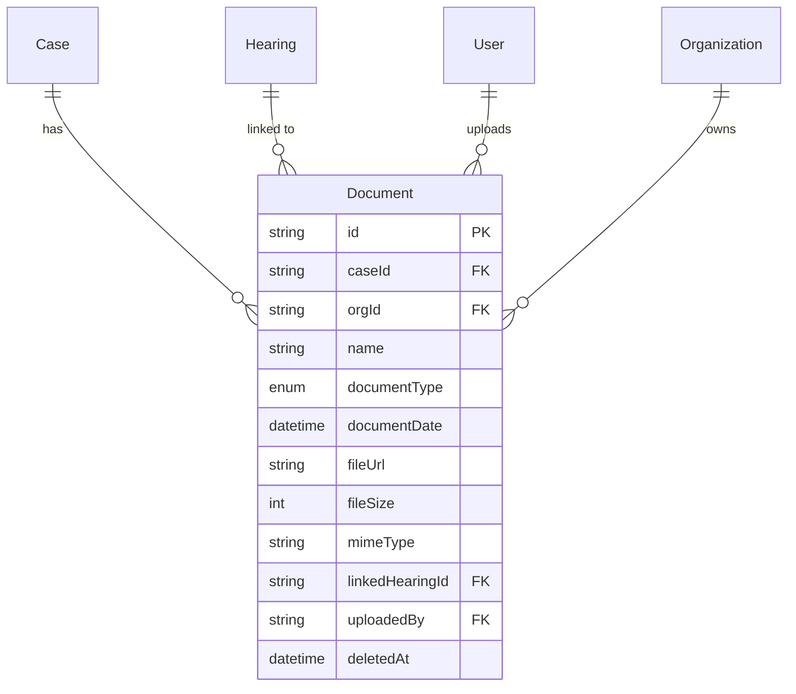
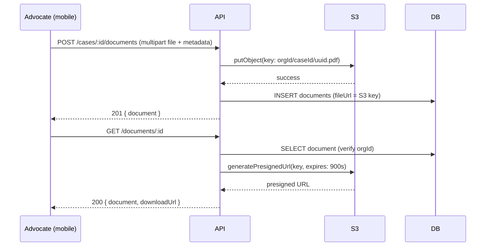

# Documents Module — Design

**Last updated:** 2026-05-19
**Branch:** chore/cases-backend (spec only — implementation in a future PR)
**Status:** Spec only — not implemented in this branch

---

## Overview

Documents are the case file, digitalised. An Indian case generates dozens of documents over its lifetime — plaints, written statements, affidavits, court orders, vakalatnamas, notices, evidence, photographs of handwritten notes.

Advocates currently scatter these across Google Drive, WhatsApp, email, and physical folders. The core promise of this module is simple: **upload it here, find it instantly later.**

Documents are not a generic storage system. Every document in Splexa is linked to a case, and optionally to a specific hearing. That context — "this affidavit belongs to Sharma vs State, it was filed at the July 15th hearing" — is what makes this useful over Drive.

**Phase 1 scope:** upload, list, view, delete. No versioning, no collaborative editing, no workflows.

---

## Relations



---

## Data Model

### Prisma Schema

```prisma
model Document {
  id              String       @id @default(uuid())
  caseId          String       @map("case_id")
  orgId           String       @map("org_id")
  name            String
  documentType    DocumentType @map("document_type")
  documentDate    DateTime?    @map("document_date")
  fileUrl         String       @map("file_url")       // S3 key (not full URL — presigned on read)
  fileSize        Int          @map("file_size")       // bytes
  mimeType        String       @map("mime_type")
  linkedHearingId String?      @map("linked_hearing_id")
  uploadedBy      String       @map("uploaded_by")
  notes           String?
  createdAt       DateTime     @default(now()) @map("created_at")
  updatedAt       DateTime     @updatedAt @map("updated_at")
  deletedAt       DateTime?    @map("deleted_at")

  case          Case         @relation(fields: [caseId], references: [id])
  org           Organization @relation(fields: [orgId], references: [id])
  linkedHearing Hearing?     @relation(fields: [linkedHearingId], references: [id])
  uploader      User         @relation("DocumentUploader", fields: [uploadedBy], references: [id])

  @@index([orgId])
  @@index([caseId])
  @@index([orgId, deletedAt])
  @@map("documents")
}
```

### Enum

```prisma
enum DocumentType {
  Filed      // Filed in court by the advocate's client
  Received   // Received from the opposite party or court
  Internal   // Internal working document — draft, notes, research
  Draft      // Draft document being prepared
}
```

### Field Notes

| Field | Why it exists |
|---|---|
| `name` | Human label — "Plaint", "Written Statement", "Order dated 10-Jul-2026" |
| `documentType` | Filed / Received / Internal / Draft — helps organise the case file |
| `documentDate` | Date of the document itself (not upload date) — "Order dated 10-Jul-2026" |
| `fileUrl` | S3 object key — never a full URL. Presigned URL generated at read time |
| `fileSize` | Bytes — for display ("2.3 MB") and storage quota enforcement later |
| `mimeType` | Allows icon/preview decisions in the UI |
| `linkedHearingId` | Optional link to a hearing — "this affidavit was filed at the July 15th hearing" |
| `notes` | Advocate's private note about this document |

**Why `fileUrl` is an S3 key, not a full URL:** Presigned URLs expire. Storing the key means we generate a fresh presigned URL on every `GET /documents/:id` call. Storing the full URL would leak credentials or require regenerating all stored URLs.

---

## API Endpoints (Planned)

```
POST   /api/v1/cases/:caseId/documents    Upload a document (multipart/form-data)
GET    /api/v1/cases/:caseId/documents    List documents for a case
GET    /api/v1/documents/:id              Get one document (returns presigned download URL)
PATCH  /api/v1/documents/:id             Update metadata (name, type, notes, linkedHearingId)
DELETE /api/v1/documents/:id              Soft delete
```

### POST /api/v1/cases/:caseId/documents

Multipart/form-data upload. The server:
1. Validates the file (size limit: 50MB, accepted mime types: PDF, image/\*, docx).
2. Uploads to S3 using the key pattern: `{orgId}/{caseId}/{uuid}.{ext}`.
3. Creates the Document record with the S3 key.

```ts
// Form fields alongside the file
{
  name: string               // required
  documentType: DocumentType // required
  documentDate?: string      // ISO date
  linkedHearingId?: string
  notes?: string
}
```

Returns `201` with the document record (no presigned URL in the creation response).

### GET /api/v1/cases/:caseId/documents

Returns all non-deleted documents for the case sorted by `createdAt DESC`. Groups by `documentType` in the response for UI display.

### GET /api/v1/documents/:id

Returns the document record plus a `downloadUrl` — a presigned S3 URL valid for 15 minutes.

```ts
// Response
{
  ...documentFields,
  downloadUrl: "https://s3.amazonaws.com/..."  // presigned, expires in 15 min
}
```

### DELETE /api/v1/documents/:id

Soft delete — sets `deletedAt`. The S3 object is NOT deleted immediately. A background job (future) cleans up orphaned S3 objects weekly.

---

## S3 Integration Architecture



**Key point:** The server is the only party that touches S3. The client never talks to S3 directly. This keeps auth simple and ensures all access is org-scoped.

---

## File Storage Rules

| Rule | Detail |
|---|---|
| Max file size | 50 MB per document |
| Accepted types | PDF, JPEG, PNG, HEIC, WEBP, DOCX, XLSX |
| S3 key pattern | `{orgId}/{caseId}/{uuid}.{extension}` |
| Presigned URL TTL | 15 minutes |
| Deletion | Soft delete in DB. S3 object retained for 30 days, then purged by background job |
| Bucket access | Private. No public access. All reads through presigned URLs. |

---

## Business Rules

1. A document always belongs to a case — `caseId` is required.
2. `orgId` is validated against `req.user.orgId` — advocates can only access documents within their org.
3. The S3 key includes `orgId` as the prefix — even if the DB were bypassed, files from different orgs are in separate key namespaces.
4. `linkedHearingId` must belong to the same case — the service validates this before saving.
5. Metadata (name, type, notes, linkedHearingId) can be updated after upload. The file itself cannot be replaced — delete and re-upload.
6. HEIC (iPhone default format) must be accepted — advocates photograph documents on their phones in court corridors.

---

## Activity Logging

```ts
ActivityAction.DOCUMENT_UPLOADED
ActivityAction.DOCUMENT_DELETED
```

---

## Implementation Notes for Future PR

### Storage — adapter pattern, not direct SDK import

Application code imports only from `@/integrations/storage/index.ts`. Never imports `@aws-sdk` directly.

```ts
// documents-service.ts
import { storageProvider } from '@/integrations/storage'

await storageProvider.upload(key, fileBuffer, mimeType)
const url = await storageProvider.presignedUrl(key, 900)
```

Default provider is **Cloudflare R2** (`STORAGE_PROVIDER=r2`). R2 is S3-compatible — the adapter uses `@aws-sdk/client-s3` pointed at the R2 endpoint. To switch to AWS S3: add `S3Adapter`, set `STORAGE_PROVIDER=s3`. Zero application code changes.

See `overview.md — External Service Adapter Pattern` for the full interface and adapter implementation.

### Required env vars

```bash
STORAGE_PROVIDER=r2
R2_ENDPOINT=https://<account_id>.r2.cloudflarestorage.com
R2_ACCESS_KEY_ID=
R2_SECRET_ACCESS_KEY=
R2_BUCKET=splexa-documents
```

### Other dependencies

- `@aws-sdk/client-s3` + `@aws-sdk/s3-request-presigner` — used by the R2 adapter
- `@fastify/multipart` — for receiving file uploads
- File validation runs before upload — reject on size or mime type before touching storage
