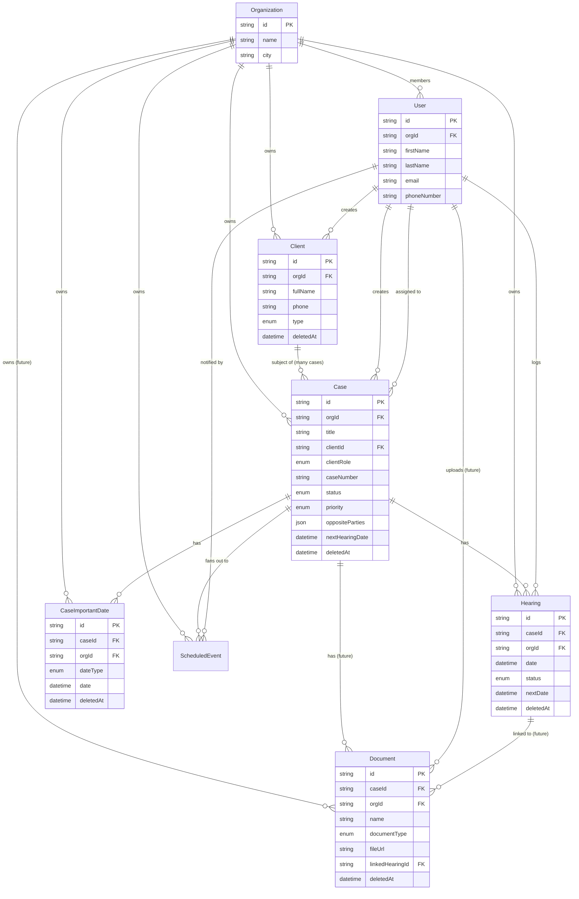

# Splexa — Cases System Overview

**Last updated:** 2026-05-19
**Branch:** chore/cases-backend

This document covers what the individual module specs do not: the full entity map, cross-module rules, cascade behaviours, ActivityAction constants, and error codes.

Read this alongside the individual specs. It is the source of truth for anything that spans more than one module.

---

## Master Entity Relationship Diagram



---

## ActivityAction Constants

All mutations across all modules call `logActivity()` using these constants.
File location: `apps/server/src/constants/activity-action.ts`

```ts
export const ActivityAction = {
  // Clients
  CLIENT_CREATED: 'client.created',
  CLIENT_UPDATED: 'client.updated',
  CLIENT_DELETED: 'client.deleted',

  // Cases
  CASE_CREATED: 'case.created',
  CASE_UPDATED: 'case.updated',
  CASE_STATUS_CHANGED: 'case.status_changed',
  CASE_ASSIGNED: 'case.assigned',
  CASE_DELETED: 'case.deleted',

  // Hearings
  HEARING_ADDED: 'hearing.added',
  HEARING_OUTCOME_UPDATED: 'hearing.outcome_updated',
  HEARING_DELETED: 'hearing.deleted',

  // Documents (future)
  DOCUMENT_UPLOADED: 'document.uploaded',
  DOCUMENT_DELETED: 'document.deleted',
} as const;

export type ActivityActionType = typeof ActivityAction[keyof typeof ActivityAction];
```

### logActivity call signature

```ts
await logActivity({
  orgId: string,
  userId: string,        // req.user.userId
  action: ActivityActionType,
  resourceType: 'client' | 'case' | 'hearing' | 'document',
  resourceId: string,
  ipAddress: string,     // req.ip
  metadata?: Record<string, unknown>,  // optional — e.g. { oldStatus, newStatus }
});
```

---

## Error Codes

All errors use `Errors.xxx()` factory from `@/utils/errors`. New factories needed for these modules:

| Factory | HTTP | Code | When |
|---|---|---|---|
| `Errors.clientNotFound()` | 404 | `CLIENT_NOT_FOUND` | Client id doesn't exist in org |
| `Errors.caseNotFound()` | 404 | `CASE_NOT_FOUND` | Case id doesn't exist in org |
| `Errors.hearingNotFound()` | 404 | `HEARING_NOT_FOUND` | Hearing id doesn't exist in org |
| `Errors.documentNotFound()` | 404 | `DOCUMENT_NOT_FOUND` | Document id doesn't exist in org |
| `Errors.hearingBelongsToDifferentCase()` | 400 | `HEARING_CASE_MISMATCH` | linkedHearingId belongs to a different case |
| `Errors.clientBelongsToDifferentOrg()` | 403 | `CLIENT_ORG_MISMATCH` | clientId belongs to a different org |

---

## Files to Create — Complete List

These files do not exist yet and must be created. Claude cannot infer them from the auth module.

```
apps/server/src/
├── constants/
│   └── activity-action.ts          ← NEW — ActivityAction constants
├── utils/
│   └── log-activity.ts             ← NEW — logActivity() helper
├── enums/
│   └── error-code.ts               ← EXTEND — add new case/client/hearing codes
├── utils/
│   └── errors.ts                   ← EXTEND — add new Errors.xxx() factories
├── app.ts                          ← EXTEND — register casesModule, clientsModule, hearingsModule
├── modules/
│   ├── clients/
│   │   ├── plugin.ts               ← NEW
│   │   ├── routes.ts               ← NEW
│   │   ├── controller.ts           ← NEW
│   │   ├── service.ts              ← NEW
│   │   ├── repository.ts           ← NEW
│   │   └── schema.ts               ← NEW
│   ├── cases/
│   │   ├── plugin.ts               ← NEW
│   │   ├── routes.ts               ← NEW
│   │   ├── controller.ts           ← NEW
│   │   ├── service.ts              ← NEW
│   │   ├── repository.ts           ← NEW
│   │   └── schema.ts               ← NEW
│   └── hearings/
│       ├── plugin.ts               ← NEW
│       ├── routes.ts               ← NEW
│       ├── controller.ts           ← NEW
│       ├── service.ts              ← NEW
│       ├── repository.ts           ← NEW
│       └── schema.ts               ← NEW

packages/shared/src/enums/
├── case-type.ts                    ← NEW
├── case-status.ts                  ← NEW
├── case-stage.ts                   ← NEW
├── court-type.ts                   ← NEW
├── priority.ts                     ← NEW
├── party-role.ts                   ← NEW
├── client-type.ts                  ← NEW
├── preferred-language.ts           ← NEW
├── hearing-status.ts               ← NEW
├── hearing-purpose.ts              ← NEW
├── important-date-type.ts          ← NEW
└── index.ts                        ← EXTEND — export all new enums

apps/server/src/
└── workers/
    └── reminder-worker.ts          ← NEW — node-cron, queries scheduled_events

apps/server/src/integrations/
├── storage/
│   ├── storage-interface.ts        ← NEW
│   ├── r2-adapter.ts               ← NEW (default provider)
│   └── index.ts                    ← NEW — factory reads STORAGE_PROVIDER env
├── sms/
│   ├── sms-interface.ts            ← NEW
│   ├── msg91-adapter.ts            ← NEW (default provider)
│   └── index.ts                    ← NEW — factory reads SMS_PROVIDER env
└── whatsapp/
    ├── whatsapp-interface.ts       ← NEW
    ├── interakt-adapter.ts         ← NEW (default provider)
    └── index.ts                    ← NEW — factory reads WHATSAPP_PROVIDER env

apps/server/prisma/schema/
├── enums/
│   ├── case-type.enum.prisma            ← NEW
│   ├── case-status.enum.prisma          ← NEW
│   ├── case-stage.enum.prisma           ← NEW
│   ├── court-type.enum.prisma           ← NEW
│   ├── priority.enum.prisma             ← NEW
│   ├── party-role.enum.prisma           ← NEW
│   ├── client-type.enum.prisma          ← NEW
│   ├── preferred-language.enum.prisma   ← NEW
│   ├── hearing-status.enum.prisma       ← NEW
│   ├── hearing-purpose.enum.prisma      ← NEW
│   ├── important-date-type.enum.prisma  ← NEW
│   └── scheduled-event-type.enum.prisma ← NEW
└── models/
    ├── client.prisma               ← NEW
    ├── case.prisma                 ← NEW
    ├── hearing.prisma              ← NEW
    ├── case-important-date.prisma  ← NEW
    └── scheduled-event.prisma      ← NEW
```

---

## logActivity() — Implementation

`AuditLog` model already exists in Prisma. Create `src/utils/log-activity.ts`:

```ts
import { prisma } from '@/db/client'

interface LogActivityInput {
  orgId: string
  userId: string
  action: string                         // ActivityAction.*
  resourceType: string                   // 'case' | 'client' | 'hearing' | 'document'
  resourceId: string
  ipAddress: string
  metadata?: Record<string, unknown>
}

export async function logActivity(input: LogActivityInput): Promise<void> {
  await prisma.auditLog.create({
    data: {
      orgId: input.orgId,
      userId: input.userId,
      action: input.action,
      resourceType: input.resourceType,
      resourceId: input.resourceId,
      ipAddress: input.ipAddress,
      metadata: input.metadata ?? {},
    },
  })
}
```

Activity logging must never throw and never block the main response. If it fails, log the error but do not propagate:

```ts
// In service methods — fire and don't await in critical paths,
// or wrap in try/catch so a logging failure never fails the request
await logActivity({ ... }).catch((err) => {
  fastify.log.error({ err }, 'logActivity failed')
})
```

---

## New ErrorCode Entries

Add to `src/enums/error-code.ts`:

```ts
// clients
CLIENT_NOT_FOUND = 'CLIENT_NOT_FOUND',
CLIENT_ORG_MISMATCH = 'CLIENT_ORG_MISMATCH',

// cases
CASE_NOT_FOUND = 'CASE_NOT_FOUND',

// hearings
HEARING_NOT_FOUND = 'HEARING_NOT_FOUND',
HEARING_CASE_MISMATCH = 'HEARING_CASE_MISMATCH',
```

Add to `src/utils/errors.ts`:

```ts
clientNotFound: () =>
  new AppError(404, ErrorCode.CLIENT_NOT_FOUND, 'Client not found.'),
clientOrgMismatch: () =>
  new AppError(403, ErrorCode.CLIENT_ORG_MISMATCH, 'Client not found.'),  // 403 not 404 — intentional
caseNotFound: () =>
  new AppError(404, ErrorCode.CASE_NOT_FOUND, 'Case not found.'),
hearingNotFound: () =>
  new AppError(404, ErrorCode.HEARING_NOT_FOUND, 'Hearing not found.'),
hearingCaseMismatch: () =>
  new AppError(400, ErrorCode.HEARING_CASE_MISMATCH, 'Hearing does not belong to this case.'),
```

---

## app.ts — Module Registration

Add all three new modules to `buildApp()` in `src/app.ts`:

```ts
import { clientsModule } from '@/modules/clients/plugin'
import { casesModule } from '@/modules/cases/plugin'
import { hearingsModule } from '@/modules/hearings/plugin'

// inside buildApp():
await app.register(clientsModule)
await app.register(casesModule)
await app.register(hearingsModule)
```

Each plugin registers with its own prefix:
- clients: `/api/v1/clients`
- cases: `/api/v1/cases`
- hearings: `/api/v1/hearings` (for cross-case) + `/api/v1/cases` (for nested routes)

---

## Enums — Two Places, Same Values

Every enum must exist in both Prisma schema (for the DB) and `packages/shared/src/enums/` (for Zod schemas and the frontend). The values must be identical.

Example for `CaseStatus`:

```prisma
// prisma/schema/enums/case-status.enum.prisma
enum CaseStatus {
  Active
  Stayed
  Disposed
  Appealed
}
```

```ts
// packages/shared/src/enums/case-status.ts
export enum CaseStatus {
  Active = 'Active',
  Stayed = 'Stayed',
  Disposed = 'Disposed',
  Appealed = 'Appealed',
}
```

```ts
// In schema.ts — use shared enum for Zod validation
import { CaseStatus } from '@splexa-group/shared/enums'
caseStatus: z.enum(CaseStatus)
```

Repeat this pattern for all 11 new enums.

---

## Zod — newClient Inline Creation

`POST /cases` requires exactly one of `clientId` or `newClient`. Use `superRefine`:

```ts
export const createCaseSchema = z.object({
  title: z.string().min(1).max(300),
  clientRole: z.enum(PartyRole),
  clientId: z.uuid().optional(),
  newClient: z.object({
    fullName: z.string().min(1).max(200),
    phone: z.string().min(7).max(20),
    type: z.enum(ClientType),
  }).optional(),
  // ... other optional fields
}).strict().superRefine((data, ctx) => {
  const hasClientId = data.clientId !== undefined
  const hasNewClient = data.newClient !== undefined
  if (hasClientId === hasNewClient) {
    ctx.addIssue({
      code: z.ZodIssueCode.custom,
      message: 'Provide either clientId or newClient, not both and not neither',
      path: ['clientId'],
    })
  }
})
```

---

## CaseImportantDate — deletedAt Required

The model in the cases spec is missing `deletedAt`. The cascade soft-delete transaction sets it. Add to the Prisma schema:

```prisma
model CaseImportantDate {
  // ... existing fields ...
  deletedAt DateTime? @map("deleted_at")   // ← required for cascade soft-delete
}
```

All queries on `case_important_dates` must include `deletedAt: null`.

---

## tags — PostgreSQL Array

`tags String[]` in Prisma maps to a PostgreSQL `text[]` column. No special config needed. Just declare it in the model. Prisma handles the array serialisation automatically.

---

## Cross-Module Imports — The One Rule That Matters

Services in different modules will need each other's data. The acceptable pattern:

**Services may import repositories from other modules.** Repositories are leaf nodes — they only import `prisma`. They never import services. So cross-module repository imports cannot create circular dependencies and are safe.

**Services must never import other services that import them back.** This creates a Node.js circular import. One module resolves as `{}` at runtime. The bug is silent and shows up as `TypeError: xxx is not a function` at the call site — extremely hard to debug.

```ts
// ✅ Safe — repos are leaf nodes, no loop possible
// cases-service.ts
import { clientsRepository } from '../clients/clients-repository'
import { hearingsRepository } from '../hearings/hearings-repository'

// ❌ Dangerous — only if both services import each other
// cases-service.ts imports clients-service
// AND clients-service.ts imports cases-service  ← circular
```

One special case: `hearings-service` updates `cases.nextHearingDate` via `casesRepository` directly (not `casesService`). This is intentional — calling `casesService` would trigger `CASE_UPDATED` activity logging, which is wrong for an internal system sync.

---

## Cross-Module Security Rules

### Rule 1 — clientId cross-tenant validation (Cases)

When `POST /api/v1/cases` is called with an existing `clientId`, the service must verify the client belongs to the same org before linking:

```ts
// cases-service.ts — createCase()
const client = await clientsRepository.findById(clientId, req.user.orgId);
if (!client) throw Errors.clientNotFound();  // null = doesn't exist OR belongs to another org
```

`findById(id, orgId)` already scopes by orgId — if the client exists in another org, it returns null. The error response is 404 (not 403) to avoid confirming whether the id exists at all.

### Rule 2 — caseId filter on GET /hearings (Hearings)

When `GET /api/v1/hearings?caseId=xxx` is called, the service does not need to explicitly validate the caseId belongs to the org. The hearings query already filters `WHERE orgId = req.user.orgId` — this means hearings from another org's case simply return 0 results. No information leak.

### Rule 3 — linkedHearingId validation (Documents)

When a document is linked to a hearing via `linkedHearingId`, the service must verify the hearing belongs to the same case as the document:

```ts
// documents-service.ts — uploadDocument()
if (linkedHearingId) {
  const hearing = await hearingsRepository.findById(linkedHearingId, orgId);
  if (!hearing) throw Errors.hearingNotFound();
  if (hearing.caseId !== caseId) throw Errors.hearingBelongsToDifferentCase();
}
```

---

## Cascade Soft-Delete Behaviour

When a parent record is soft-deleted, its children must also be soft-deleted atomically in the same `$transaction`.

### Case deleted → cascade to hearings + important dates

```ts
// cases-service.ts — deleteCase()
await prisma.$transaction([
  // Soft-delete the case
  prisma.cases.updateMany({
    where: { id: caseId, orgId, deletedAt: null },
    data: { deletedAt: now },
  }),
  // Cascade to hearings
  prisma.hearings.updateMany({
    where: { caseId, orgId, deletedAt: null },
    data: { deletedAt: now },
  }),
  // Cascade to important dates
  prisma.caseImportantDates.updateMany({
    where: { caseId, orgId },
    data: { deletedAt: now },
  }),
]);
```

**Why this approach:** Hearings have their own `orgId` and their own `deletedAt`. Every hearing query already filters `deletedAt: null`. When a case is deleted, cascading soft-delete means the cross-case `GET /hearings` calendar query stays simple — it never needs to join the cases table to check if the parent case is deleted.

**Documents (future):** When the documents module is built, it must also be included in this cascade transaction.

The cascade must also soft-delete all `scheduled_events` rows for the case:

```ts
prisma.scheduledEvents.updateMany({
  where: { caseId, orgId, deletedAt: null },
  data: { deletedAt: now },
}),
```

### Client deleted → no cascade to cases

A client being soft-deleted does NOT cascade to their cases. The cases remain active. The case detail response includes the client record even if `deletedAt` is set — the client's data is still needed for context (name, phone).

The client's `fullName` should still be shown in case detail. When rendering in the frontend, show a `[deleted]` badge next to the client name if `client.deletedAt` is not null.

```ts
// cases-repository.ts — findById select
client: {
  select: { id: true, fullName: true, phone: true, deletedAt: true },
}
// deletedAt included so the frontend can show the [deleted] badge
```

---

## Phone Uniqueness — Soft Constraint, Not Hard

The clients spec originally listed phone uniqueness as a hard constraint (unique index). This is relaxed:

**Why:** Two clients can legitimately share a phone number — family members who consult the same advocate, a company reception number shared across contacts. A unique index would block valid data.

**Actual behaviour:** No unique index on `phone`. Instead, when a new client is created, the service runs a check for existing active clients with the same phone in the org. If found:
- The client is still created successfully.
- The response includes a `warning: 'PHONE_ALREADY_EXISTS'` field with the existing client's id and name.
- The frontend can show a non-blocking banner: "A client with this phone number already exists — Rajesh Sharma. Are you sure this is a different person?"

This is a service-layer check, not a DB constraint.

---

## nextHearingDate — Who Writes It

**Only the hearings service writes `cases.nextHearingDate`.** The cases service never touches this field directly.

Every hearing mutation (create, update, delete) triggers `recalculateNextHearingDate()` inside the same transaction. The logic:

1. Find the earliest non-deleted, Scheduled hearing for the case with `date >= now`.
2. Set `cases.nextHearingDate` to that date, or `null` if none.

Edge case: if a hearing is marked `Completed` or `Cancelled` and it was the next hearing, the recalculation clears `nextHearingDate` until a new hearing is added.

---

## Important Dates — Notification Target

The `case_important_dates` table does not have a `notifyUserId` field. When the reminders module (future) queries for approaching limitation dates, it determines the notification target using this priority:

1. `cases.assignedTo` — if set, notify that user.
2. `cases.createdBy` — if `assignedTo` is null, notify the creator.

This logic lives in the reminders module. The cases/important-dates schema does not need a `notifyUserId` column.

---

## Document + Soft-Deleted Hearing

When a document is linked to a hearing (`linkedHearingId`), and that hearing is later soft-deleted:

- The document remains fully accessible.
- The `linkedHearingId` is retained (not nulled out) — it preserves the historical link.
- The `GET /cases/:caseId/documents` query does NOT filter or join on `hearing.deletedAt`. It returns all non-deleted documents for the case regardless of the linked hearing's state.
- The frontend handles a deleted linked hearing gracefully: show "Hearing (removed)" instead of the hearing date.

---

## Scheduled Events — Fan-Out Table

### Why it exists

The reminders module (background worker) needs to find all upcoming dates across all cases for an org — hearing dates, limitation dates, bail expiry, and future task deadlines. Without a dedicated table, the worker would need to query and join multiple tables on every run. As new date types are added, the worker query grows more complex.

`scheduled_events` is a fan-out table. It is **not the source of truth** — it is a derived copy maintained for efficient querying by the background worker. The source of truth stays in `hearings`, `case_important_dates`, and future `tasks` tables.

### Schema

```prisma
model ScheduledEvent {
  id           String             @id @default(uuid())
  orgId        String             @map("org_id")
  caseId       String             @map("case_id")
  notifyUserId String             @map("notify_user_id")
  eventType    ScheduledEventType @map("event_type")
  date         DateTime
  title        String                                     // "Next Hearing — Sharma vs State"
  sourceId     String             @map("source_id")      // hearingId / importantDateId / taskId
  sourceType   String             @map("source_type")    // 'hearing' | 'important_date' | 'task'
  notifiedAt   DateTime?          @map("notified_at")    // set after reminder is sent
  deletedAt    DateTime?          @map("deleted_at")

  org        Organization @relation(fields: [orgId], references: [id])
  case       Case         @relation(fields: [caseId], references: [id])
  notifyUser User         @relation(fields: [notifyUserId], references: [id])

  @@index([orgId, date])
  @@index([date, notifiedAt, deletedAt])  // background worker query index
  @@map("scheduled_events")
}
```

```prisma
enum ScheduledEventType {
  HearingDate
  LimitationDate
  BailExpiry
  StayExpiry
  AppealDeadline
  InjunctionValidity
  Task
}
```

### Who writes to it

| Action | Source table | scheduled_events write |
|---|---|---|
| Hearing created (Scheduled) | `hearings` | INSERT — type: HearingDate, date: hearing.date |
| Hearing updated with nextDate | `hearings` | UPDATE sourceId=hearingId — set new date |
| Hearing soft-deleted | `hearings` | soft-delete matching row (sourceId=hearingId) |
| Important date created | `case_important_dates` | INSERT — type matches dateType |
| Important date updated | `case_important_dates` | UPDATE sourceId=importantDateId |
| Important date deleted | `case_important_dates` | soft-delete matching row |
| Case soft-deleted | `cases` | soft-delete ALL rows where caseId matches |

All writes happen inside the same `$transaction` as the source mutation.

### notifyUserId resolution

```ts
// Resolved at write time, not at query time — keeps the worker simple
const notifyUserId = case_.assignedTo ?? case_.createdBy
```

### Background worker query (Phase 1 — node-cron)

```ts
// runs every hour inside the Fastify process
const upcoming = await prisma.scheduledEvents.findMany({
  where: {
    date: { gte: now, lte: addDays(now, 7) },
    notifiedAt: null,
    deletedAt: null,
  },
  include: { case: { select: { title: true } }, notifyUser: true },
})

for (const event of upcoming) {
  await notificationProvider.send(event)
  await prisma.scheduledEvents.update({
    where: { id: event.id },
    data: { notifiedAt: new Date() },
  })
}
```

One table, one query, zero joins needed. Adding new event types (tasks, court orders) only requires writing to `scheduled_events` from the new module — the worker query never changes.

### Cascade when case is deleted

Add to the case soft-delete transaction:

```ts
prisma.scheduledEvents.updateMany({
  where: { caseId, orgId, deletedAt: null },
  data: { deletedAt: now },
}),
```

---

## External Service Adapter Pattern

Every external service (storage, SMS, WhatsApp, email) must be behind an interface with a factory that resolves the provider from an env var. Application code imports only from `@/integrations/[type]/index.ts` — never from an adapter or SDK directly.

This is already established in the codebase for email (`integrations/email/`). The same pattern applies to all new services.

### Pattern (follows existing email adapter exactly)

```
integrations/
├── email/
│   ├── email-interface.ts     ← interface EmailProvider
│   ├── resend-adapter.ts      ← implements EmailProvider
│   └── index.ts               ← factory: reads EMAIL_PROVIDER env var
├── storage/
│   ├── storage-interface.ts   ← interface StorageProvider   (NEW)
│   ├── r2-adapter.ts          ← implements StorageProvider  (NEW)
│   └── index.ts               ← factory: reads STORAGE_PROVIDER env var (NEW)
├── sms/
│   ├── sms-interface.ts       ← interface SmsProvider       (NEW)
│   ├── msg91-adapter.ts       ← implements SmsProvider      (NEW)
│   └── index.ts               ← factory: reads SMS_PROVIDER env var (NEW)
└── whatsapp/
    ├── whatsapp-interface.ts  ← interface WhatsAppProvider  (NEW)
    ├── interakt-adapter.ts    ← implements WhatsAppProvider (NEW)
    └── index.ts               ← factory: reads WHATSAPP_PROVIDER env var (NEW)
```

### Storage adapter

```ts
// integrations/storage/storage-interface.ts
export interface StorageProvider {
  upload(key: string, body: Buffer, mimeType: string): Promise<void>
  presignedUrl(key: string, expiresInSeconds: number): Promise<string>
  delete(key: string): Promise<void>
}
```

```ts
// integrations/storage/r2-adapter.ts
import { S3Client, PutObjectCommand, DeleteObjectCommand } from '@aws-sdk/client-s3'
import { getSignedUrl } from '@aws-sdk/s3-request-presigner'

export class R2Adapter implements StorageProvider {
  private client = new S3Client({
    region: 'auto',
    endpoint: env.R2_ENDPOINT,   // https://<account_id>.r2.cloudflarestorage.com
    credentials: {
      accessKeyId: env.R2_ACCESS_KEY_ID,
      secretAccessKey: env.R2_SECRET_ACCESS_KEY,
    },
  })

  async upload(key: string, body: Buffer, mimeType: string) {
    await this.client.send(new PutObjectCommand({
      Bucket: env.R2_BUCKET,
      Key: key,
      Body: body,
      ContentType: mimeType,
    }))
  }

  async presignedUrl(key: string, expiresInSeconds: number) {
    return getSignedUrl(this.client, new GetObjectCommand({
      Bucket: env.R2_BUCKET, Key: key,
    }), { expiresIn: expiresInSeconds })
  }

  async delete(key: string) {
    await this.client.send(new DeleteObjectCommand({ Bucket: env.R2_BUCKET, Key: key }))
  }
}
```

```ts
// integrations/storage/index.ts
function createStorageProvider(): StorageProvider {
  switch (env.STORAGE_PROVIDER) {
    case 'r2':
    default:
      return new R2Adapter()
  }
}
export const storageProvider = createStorageProvider()
```

To switch to AWS S3: add `S3Adapter implements StorageProvider`, set `STORAGE_PROVIDER=s3`. Zero application code changes.

---

### SMS adapter

```ts
// integrations/sms/sms-interface.ts
export interface SmsProvider {
  send(to: string, message: string): Promise<void>
}
```

```ts
// integrations/sms/index.ts
function createSmsProvider(): SmsProvider {
  switch (env.SMS_PROVIDER) {
    case 'msg91':
    default:
      return new Msg91Adapter()
  }
}
export const smsProvider = createSmsProvider()
```

Default: MSG91 (cheapest in India, ~₹0.30/SMS). To switch to Twilio: add `TwilioSmsAdapter`, set `SMS_PROVIDER=twilio`.

---

### WhatsApp adapter

```ts
// integrations/whatsapp/whatsapp-interface.ts
export interface WhatsAppProvider {
  sendHearingReminder(to: string, params: HearingReminderParams): Promise<void>
}
```

```ts
// integrations/whatsapp/index.ts
function createWhatsAppProvider(): WhatsAppProvider {
  switch (env.WHATSAPP_PROVIDER) {
    case 'interakt':
    default:
      return new InteraktAdapter()
  }
}
export const whatsAppProvider = createWhatsAppProvider()
```

Default: Interakt (Indian provider, cheapest for WhatsApp Business API). To switch to Gupshup or Twilio: add adapter, set `WHATSAPP_PROVIDER=gupshup`.

---

### Required env vars

```bash
# Storage
STORAGE_PROVIDER=r2
R2_ENDPOINT=https://<account_id>.r2.cloudflarestorage.com
R2_ACCESS_KEY_ID=
R2_SECRET_ACCESS_KEY=
R2_BUCKET=splexa-documents

# SMS
SMS_PROVIDER=msg91
MSG91_API_KEY=
MSG91_TEMPLATE_ID=

# WhatsApp
WHATSAPP_PROVIDER=interakt
INTERAKT_API_KEY=

# Email (already exists)
EMAIL_PROVIDER=resend
RESEND_API_KEY=
EMAIL_FROM=noreply@splexa.in
```

---

## Shared Response Types

These types should be defined in the shared package (`packages/shared/src/types/`) so both backend (for validation) and frontend (for typed API client) use the same shapes.

```ts
// packages/shared/src/types/cases.ts
export type PaginatedResult<T> = {
  data: T[]
  total: number
  page: number
  limit: number
}

export type CaseSummary = {
  id: string
  title: string
  caseNumber: string | null
  status: CaseStatus
  priority: Priority | null
  courtName: string | null
  nextHearingDate: string | null
  clientRole: PartyRole
  client: { id: string; fullName: string; phone: string }
}

export type ClientSummary = {
  id: string
  fullName: string
  phone: string
  type: ClientType
  caseCount: number
}
```
