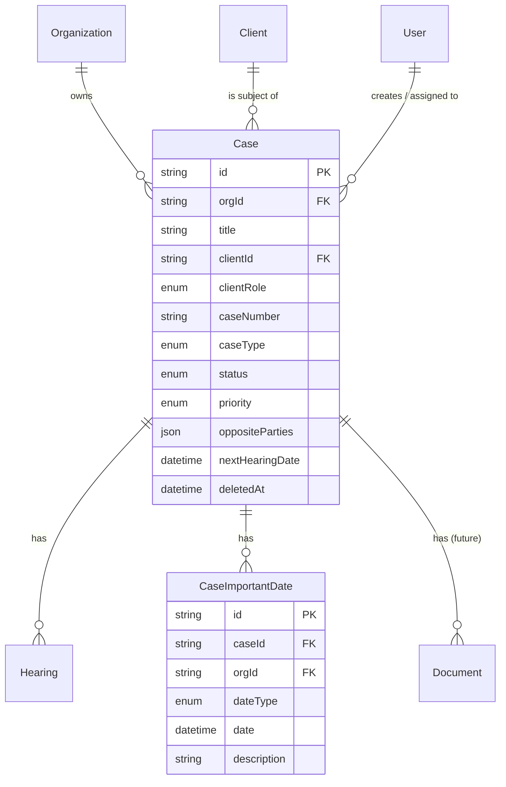
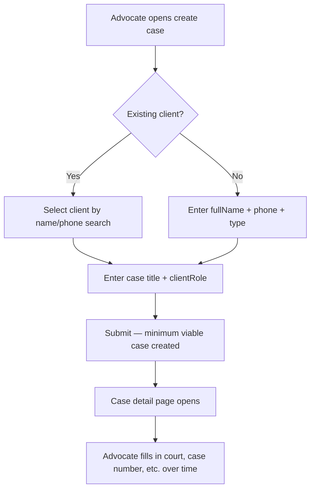

# Cases Module — Design

**Last updated:** 2026-05-19
**Branch:** chore/cases-backend
**Status:** Spec — implementation in progress

---

## Overview

The case is the central object in Splexa. Everything else — hearings, documents, clients, reminders — connects to a case. The case record is how an advocate digitises their file on a matter.

A case is not a form to fill in once. It is a living record that grows over months or years as hearings happen, documents are filed, and the matter progresses. The data model must support both the "create quickly, fill in later" flow and the "fully documented matter" state.

**Minimum to create a case:** title + client. Everything else is optional at creation time.

---

## Relations



---

## Data Model

### Prisma Schema — Case

```prisma
model Case {
  id           String     @id @default(uuid())
  orgId        String     @map("org_id")

  // Core — only these two are required
  title        String
  clientId     String     @map("client_id")
  clientRole   PartyRole  @map("client_role")

  // Case identity
  caseNumber   String?    @map("case_number")    // CNR — optional at creation
  caseType     CaseType?  @map("case_type")
  filingDate   DateTime?  @map("filing_date")

  // Court
  courtName    String?    @map("court_name")
  courtType    CourtType? @map("court_type")
  courtState   String?    @map("court_state")
  courtCity    String?    @map("court_city")
  benchNumber  String?    @map("bench_number")

  // Judge — changes frequently, track when it was last updated
  judgeName         String?   @map("judge_name")
  judgeDesignation  String?   @map("judge_designation")
  judgeUpdatedAt    DateTime? @map("judge_updated_at")

  // Classification
  status   CaseStatus @default(Active)
  stage    CaseStage? 
  priority Priority?

  // Opposite parties stored as JSON — no cross-case queries needed in Phase 1
  oppositeParties Json? @map("opposite_parties")

  // Internal
  notes String?
  tags  String[]

  // Denormalised — written by the hearings module when a hearing is added or updated
  nextHearingDate DateTime? @map("next_hearing_date")

  // Assignment
  assignedTo String? @map("assigned_to")
  createdBy  String  @map("created_by")

  createdAt DateTime  @default(now()) @map("created_at")
  updatedAt DateTime  @updatedAt @map("updated_at")
  deletedAt DateTime? @map("deleted_at")

  org          Organization       @relation(fields: [orgId], references: [id])
  client       Client             @relation(fields: [clientId], references: [id])
  creator      User               @relation("CaseCreator", fields: [createdBy], references: [id])
  assignedUser User?              @relation("CaseAssignment", fields: [assignedTo], references: [id])
  hearings     Hearing[]
  importantDates CaseImportantDate[]
  documents    Document[]

  @@index([orgId])
  @@index([orgId, status])
  @@index([orgId, clientId])
  @@index([orgId, deletedAt])
  @@index([orgId, nextHearingDate])
  @@map("cases")
}
```

### Prisma Schema — CaseImportantDate

```prisma
model CaseImportantDate {
  id          String            @id @default(uuid())
  caseId      String            @map("case_id")
  orgId       String            @map("org_id")
  dateType    ImportantDateType @map("date_type")
  date        DateTime
  description String?
  createdAt   DateTime          @default(now()) @map("created_at")
  updatedAt   DateTime          @updatedAt @map("updated_at")
  deletedAt   DateTime?         @map("deleted_at")

  case Case         @relation(fields: [caseId], references: [id])
  org  Organization @relation(fields: [orgId], references: [id])

  @@index([orgId, date])
  @@index([caseId])
  @@index([orgId, deletedAt])
  @@map("case_important_dates")
}
```

### Enums

```prisma
enum CaseType {
  Civil
  Criminal
  Family
  Consumer
  Labour
  Revenue
  Writ
  Corporate
  Other
}

enum CaseStatus {
  Active
  Stayed
  Disposed
  Appealed
}

enum CaseStage {
  PreTrial
  Trial
  Arguments
  Judgment
  Execution
}

enum CourtType {
  DistrictCourt
  HighCourt
  SupremeCourt
  Tribunal
  ConsumerForum
  FamilyCourt
  Other
}

enum Priority {
  High
  Medium
  Low
}

enum PartyRole {
  Petitioner
  Respondent
  Accused
  Complainant
}

enum ImportantDateType {
  Limitation
  BailExpiry
  StayExpiry
  AppealDeadline
  InjunctionValidity
  Other
}
```

### Opposite Parties JSON Shape

`oppositeParties` is a `Json?` column. It stores an array of objects with this structure:

```ts
type OppositeParty = {
  name: string
  role: PartyRole
  advocateName?: string
  advocatePhone?: string
  address?: string
}

// Example value stored in the column:
[
  {
    "name": "State of Telangana",
    "role": "Respondent",
    "advocateName": "Suresh Kumar",
    "advocatePhone": "+91 98765 43210",
    "address": null
  }
]
```

**Why JSON and not a separate table:** In Phase 1, opposite party data is only read when viewing a specific case — there are no cross-case queries ("find all cases where opposite party is X"). A separate table adds join complexity and two extra API routes for no Phase 1 benefit. If cross-case querying becomes a requirement, this migrates cleanly to a table.

---

## API Endpoints

All routes are protected by `fastify.authenticate`. `orgId` always from `req.user.orgId`.

```
POST   /api/v1/cases                              Create a case
GET    /api/v1/cases                              List cases (filter + search + paginate)
GET    /api/v1/cases/:id                          Get one case (full detail)
PATCH  /api/v1/cases/:id                          Update a case
DELETE /api/v1/cases/:id                          Soft delete a case

POST   /api/v1/cases/:id/important-dates          Add an important date
PATCH  /api/v1/cases/:id/important-dates/:dateId  Update an important date
DELETE /api/v1/cases/:id/important-dates/:dateId  Remove an important date
```

### POST /api/v1/cases

Supports two client patterns — `clientId` (existing) or `newClient` (inline creation). Exactly one must be provided.

```ts
// Body (Zod schema)
{
  title: string              // required
  clientRole: PartyRole      // required

  // Exactly one of:
  clientId?: string
  newClient?: {
    fullName: string         // required
    phone: string            // required
    type: ClientType         // required
  }

  // All optional at creation:
  caseNumber?: string
  caseType?: CaseType
  filingDate?: string        // ISO date
  courtName?: string
  courtType?: CourtType
  courtState?: string
  courtCity?: string
  benchNumber?: string
  judgeName?: string
  judgeDesignation?: string
  status?: CaseStatus        // defaults to Active
  stage?: CaseStage
  priority?: Priority
  oppositeParties?: OppositeParty[]
  notes?: string
  tags?: string[]
  assignedTo?: string        // userId
}
```

If `newClient` is provided, the service creates the client and the case inside a single `$transaction`. Returns `201` with the full case object including the created or linked client.

Logs `ActivityAction.CASE_CREATED`. If client was created inline, also logs `ActivityAction.CLIENT_CREATED`.

### GET /api/v1/cases

```ts
// Query params
search?: string      // searches: title, caseNumber, courtName, client.fullName (ILIKE)
status?: CaseStatus
caseType?: CaseType
priority?: Priority
courtType?: CourtType
clientId?: string
page?: number        // default 1
limit?: number       // default 20, max 100
```

**Default sort:** `nextHearingDate ASC NULLS LAST`, then `updatedAt DESC`. Cases with upcoming hearings surface first — this matches how an advocate prioritises their day.

**Response**
```ts
{
  data: CaseSummary[]   // id, title, caseNumber, status, priority, courtName,
                        // nextHearingDate, client { id, fullName, phone }, clientRole
  total: number
  page: number
  limit: number
}
```

### GET /api/v1/cases/:id

Full case detail including: client, hearings (latest 5, sorted by date desc), importantDates, oppositeParties JSON.

### PATCH /api/v1/cases/:id

Partial update of any field. If `oppositeParties` is provided, the entire JSON array is replaced.

If `status` changes, logs `ActivityAction.CASE_STATUS_CHANGED`. Otherwise logs `ActivityAction.CASE_UPDATED`.

If `judgeName` or `judgeDesignation` changes, the service automatically sets `judgeUpdatedAt = now()`.

### DELETE /api/v1/cases/:id

Cascading soft delete — atomically soft-deletes the case, all its hearings, and all its important dates in a single `$transaction`. This keeps hearing queries simple — the cross-case calendar (`GET /hearings`) never needs to join cases to check if the parent is deleted.

See `overview.md` for the full cascade transaction pattern.

Logs `ActivityAction.CASE_DELETED`.

---

## Search Behaviour

Search runs across four fields simultaneously:

```ts
where: {
  orgId,
  deletedAt: null,
  OR: [
    { title: { contains: search, mode: 'insensitive' } },
    { caseNumber: { contains: search, mode: 'insensitive' } },
    { courtName: { contains: search, mode: 'insensitive' } },
    { client: { fullName: { contains: search, mode: 'insensitive' } } },
  ]
}
```

Results appear as the user types — the frontend debounces the request; the backend has no debounce logic.

---

## Workflow: Creating a Case



---

## Business Rules

1. `title` and `clientId` (or `newClient`) are the only required fields. All other fields can be filled later.
2. `orgId` always from `req.user.orgId` — never body, params, or query.
3. When `clientId` is provided, the service validates the client belongs to the same org by calling `clientsRepository.findById(clientId, orgId)`. If null, return `404 CLIENT_NOT_FOUND` — this covers both "doesn't exist" and "belongs to another org" without confirming which.
3. `caseNumber` (CNR) is optional — courts assign this; lawyers often don't have it at case creation.
4. `nextHearingDate` on the cases table is denormalised — it is written by the hearings service when a hearing is created or its outcome is updated. The cases service never writes this field directly.
5. `judgeUpdatedAt` is auto-set by the service whenever `judgeName` or `judgeDesignation` changes. The frontend displays this as "Judge: Ramesh Kumar (updated 3 days ago)" so the advocate knows how stale the data is.
6. Soft delete uses `updateMany` with both `id` and `orgId` — never `update` with `id` alone.
7. `tags` are free-form strings stored as a PostgreSQL array. No tag master table.

---

## Activity Logging

```ts
ActivityAction.CASE_CREATED
ActivityAction.CASE_UPDATED
ActivityAction.CASE_STATUS_CHANGED   // when status field specifically changes
ActivityAction.CASE_ASSIGNED         // when assignedTo changes
ActivityAction.CASE_DELETED
```
