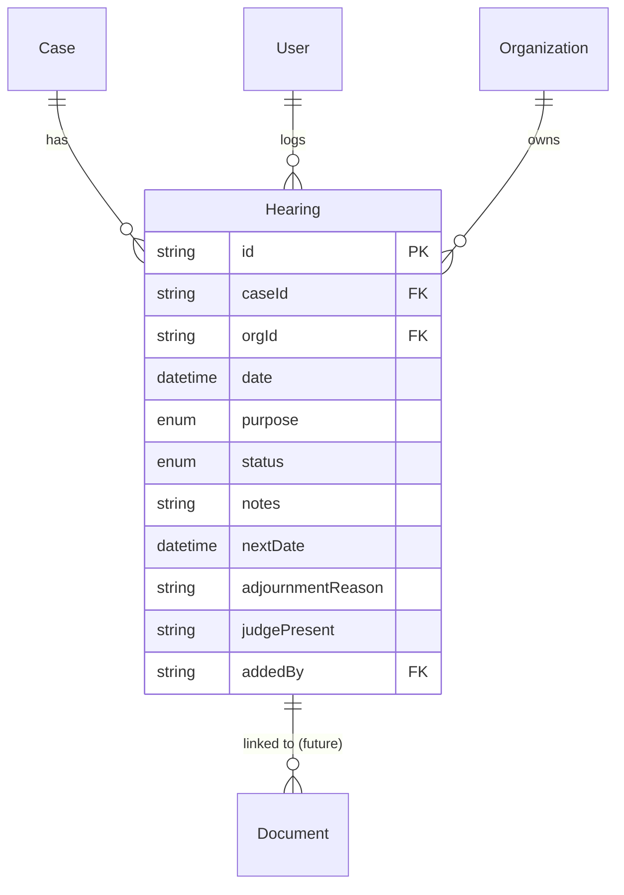
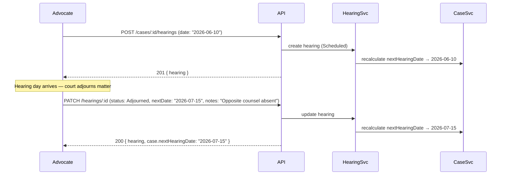

# Hearings Module — Design

**Last updated:** 2026-05-19
**Branch:** chore/cases-backend
**Status:** Spec — implementation in progress

---

## Overview

Hearings are the most critical feature in Splexa. An Indian advocate's biggest professional fear is missing a hearing date. This module tracks every scheduled and completed hearing for every case.

In Indian courts, adjournment is the norm. A hearing gets scheduled, the advocate appears, the matter is adjourned to a new date. This cycle repeats dozens of times over the life of a case. The product must make it fast to log an outcome and set the next date — target: under 20 seconds.

The hearings module also maintains `cases.nextHearingDate` (denormalised). Whenever a hearing is added, updated, or deleted, the service recalculates and updates that field on the parent case.

---

## Relations



---

## Data Model

### Prisma Schema

```prisma
model Hearing {
  id                String         @id @default(uuid())
  caseId            String         @map("case_id")
  orgId             String         @map("org_id")
  date              DateTime
  purpose           HearingPurpose?
  status            HearingStatus  @default(Scheduled)
  notes             String?                              // "What happened"
  nextDate          DateTime?      @map("next_date")    // Date given in court
  adjournmentReason String?        @map("adjournment_reason")
  judgePresent      String?        @map("judge_present")
  addedBy           String         @map("added_by")
  createdAt         DateTime       @default(now()) @map("created_at")
  updatedAt         DateTime       @updatedAt @map("updated_at")
  deletedAt         DateTime?      @map("deleted_at")

  case      Case         @relation(fields: [caseId], references: [id])
  org       Organization @relation(fields: [orgId], references: [id])
  adder     User         @relation("HearingAdder", fields: [addedBy], references: [id])
  documents Document[]

  @@index([caseId])
  @@index([orgId, date])
  @@index([orgId, status])
  @@map("hearings")
}
```

### Enums

```prisma
enum HearingStatus {
  Scheduled
  Completed
  Adjourned
  Cancelled
}

enum HearingPurpose {
  Arguments
  Evidence
  CrossExamination
  Order
  Mention
  Settlement
  Miscellaneous
}
```

### Field Notes

| Field | Why it exists |
|---|---|
| `date` | The scheduled date for this hearing |
| `purpose` | What the hearing was supposed to cover — optional, advocate fills in what they know |
| `status` | Lifecycle of the hearing — starts Scheduled, updated after court appearance |
| `notes` | Brief description of what happened — "Adjourned, opposing counsel absent" |
| `nextDate` | The date the court gave for the next appearance — drives `cases.nextHearingDate` |
| `adjournmentReason` | Optional — why was it adjourned |
| `judgePresent` | Optional — judges transfer frequently, useful but not always known in advance |
| `addedBy` | Which team member logged this hearing |

---

## API Endpoints

All routes are protected by `fastify.authenticate`. `orgId` always from `req.user.orgId`.

```
POST   /api/v1/cases/:caseId/hearings    Add a hearing to a case
GET    /api/v1/cases/:caseId/hearings    List all hearings for a case
GET    /api/v1/hearings                  List hearings across all cases (for calendar/dashboard)
PATCH  /api/v1/hearings/:id              Update a hearing (outcome, notes, nextDate)
DELETE /api/v1/hearings/:id              Cancel / remove a hearing
```

### POST /api/v1/cases/:caseId/hearings

Creates a scheduled hearing. The advocate adds this when they know a court date is coming.

```ts
// Body (Zod schema)
{
  date: string           // required — ISO datetime
  purpose?: HearingPurpose
  notes?: string
  judgePresent?: string
}
```

On creation:
1. Creates the hearing with `status = Scheduled`.
2. Recalculates `nextHearingDate` on the parent case — sets it to the earliest future `Scheduled` hearing date.
3. Logs `ActivityAction.HEARING_ADDED`.

Returns `201` with the hearing.

### GET /api/v1/cases/:caseId/hearings

Returns all hearings for the case sorted by `date DESC` (most recent first). No pagination — a case rarely has more than 50 hearings.

### GET /api/v1/hearings

Cross-case hearing list — used by dashboard and calendar.

```ts
// Query params
from?: string       // ISO date — filter hearings on or after this date
to?: string         // ISO date — filter hearings on or before this date
status?: HearingStatus
caseId?: string
page?: number       // default 1
limit?: number      // default 20, max 100
```

Each result includes the case title and client name — so the dashboard can show "Sharma vs State — District Court Hyderabad" without a second request.

### PATCH /api/v1/hearings/:id

The primary action after a hearing happens. The advocate opens the case, finds the hearing, and logs what happened.

```ts
// Body (Zod schema — all optional, but at least one field required)
{
  status?: HearingStatus
  notes?: string
  nextDate?: string          // required when status = Adjourned
  adjournmentReason?: string
  judgePresent?: string
  purpose?: HearingPurpose
}
```

**Critical side effect:** After any update, the service recalculates `cases.nextHearingDate`:
- Find the earliest future `Scheduled` hearing for this case.
- Set `cases.nextHearingDate` to that date (or `null` if none).

Both the hearing update and the case update happen inside a `$transaction`.

Returns `200` with the updated hearing.

Logs `ActivityAction.HEARING_OUTCOME_UPDATED`.

### DELETE /api/v1/hearings/:id

Soft delete — sets `deletedAt`. The hearing is excluded from all timeline and list queries. After deletion, recalculates `cases.nextHearingDate` (ignoring deleted hearings).

Logs `ActivityAction.HEARING_DELETED`.

---

## Workflow: Full Hearing Lifecycle



---

## nextHearingDate Recalculation Logic

This runs after every hearing create, update, or delete:

```ts
async function recalculateNextHearingDate(caseId: string, orgId: string, tx: PrismaTransaction) {
  const nextHearing = await tx.hearings.findFirst({
    where: {
      caseId,
      orgId,
      status: HearingStatus.Scheduled,
      date: { gte: new Date() },
      deletedAt: null,
    },
    orderBy: { date: 'asc' },
    select: { date: true },
  });

  await tx.cases.updateMany({
    where: { id: caseId, orgId },
    data: { nextHearingDate: nextHearing?.date ?? null },
  });
}
```

This must always run inside the same `$transaction` as the hearing mutation.

---

## Business Rules

1. A hearing belongs to a case — `caseId` and `orgId` are always required on creation.
2. `orgId` on the hearing is duplicated from the case — this allows direct `WHERE orgId = ?` scoping on hearings without a join to cases, which matters for the cross-case calendar query.
3. `nextDate` is mandatory when `status = Adjourned` — the Zod schema enforces this with `superRefine`.
4. `nextHearingDate` on the case is never written directly by the cases service — only the hearings service updates this field, always inside a transaction.
5. Hearings are soft-deleted — `deletedAt` is set. All list and timeline queries filter `deletedAt: null`. The recalculation of `nextHearingDate` also excludes deleted hearings.
6. `GET /api/v1/hearings` with `from` and `to` defaulting to today and today+7 powers the dashboard "hearings this week" view.

---

## Activity Logging

```ts
ActivityAction.HEARING_ADDED
ActivityAction.HEARING_OUTCOME_UPDATED
ActivityAction.HEARING_DELETED
```
